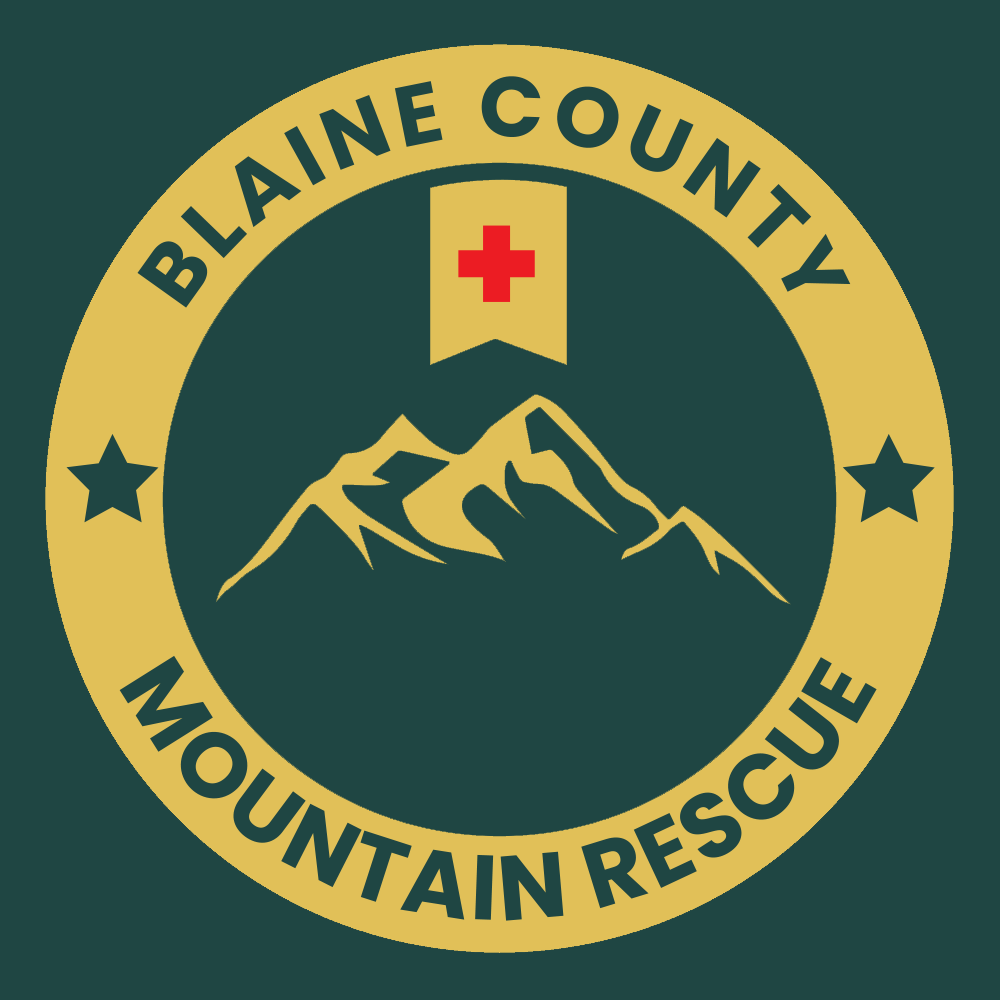

---

<!-- paginate: true -->
<!-- footer: '**Blaine County Mountain Rescue (BCMR) - Confidential**' -->

# Disclaimer

The information contained within this presentation is considered **Confidential**.

It is intended for viewing only by the San Andreas State Park Rangers and other members of the Unified Police Department. We kindly ask that you do not share its contents beyond this audience.

---

# What is Blaine County Mountain Rescue?

Blaine County Mountain Rescue (BCMR) is a non-profit volunteer organisation. Our primary responsibilities are:

- Conducting and assisting with Search & Rescue operations across the state.
- Perform community outreach through regular patrols of Blaine County, providing emergency supplies, roadside repair, wilderness tours and a wide range of events.

---

# Command Team

- Fresh Juice, Co-Chief
- Cayden Bottomley, Co-Chief
- Skud Oftr, Captain
- Max Moody, Captain

---

# Ranks

Rank | Description
-----|-----
Chief | The leaders of the organisation. Work with the command team on all issues pertaining to BCMR.
Captain | Part of the command team alongside Chiefs. 
Senior SAR Officer | Officers with advanced training and experience in the field.
SAR Officer | Members who have completed basic training and are eligble for additional certifications.
Job Ready Trainee | A Trainee who has been signed off on all basic duties and is eligble to be on call and respond to calls.
Trainee | The newest members of the organization. Participate in ridealongs with SAR Officers and higher. Require training in Life Preservation, Navigation and Operations.

---

# Certifications

- Advanced Off Road (AOR)
- Water Borne (H2O)
- AirBourne (Air)
- Advanced Incident Commander (AIC)
- Field Training Officer (FTO)

---

# Short Term Goals

Short term goals are those we can achieve with the tools we have available to us now. We expect to achieve all these goals in due course.

- Work with command team to define short, medium and long term goals for BCMR.
- Audit BCMR business account:
  - Ensure that only the current command team have access to account(s).
  - Create financial reports of incomings & outgoings.
- Check in with all current members of BCMR; review training status, level of interest, check well-being etc.
- Formalise relationship with Park Rangers and assign designated contacts for each shift.

---

# Medium Term Goals (1/2)

Medium term goals are those that we can realistically achieve using means already available in the city. We can expect to achieve many (though certainly not all) of these goals.

- Reestablish funding sources (market sales, donations, sponsorships or other)
- Start a new recruiting drive
- Complete purchase and outfitting of a Storefront to act as a base of operations
- Establish supply chain for perishable BCMR goods
- Renegotiate agreement for state-issued binoculars and flashlights
- "Official" BCMR vehicle with matching livery

---

# Medium Term Goals (2/2)

- Shared business garage with contractual agreement for vehicle sharing
- BCMR or wilderness themed tattoo (e.g. a compass)
- Work with Rangers to implement a "wilderness threat level" based on level of violence, crime etc. occuring like fishing/hunting robberies
- Consider partnership with pawn shop for cheaper compasses
- Consider expanding partnership with Hayes for cheaper radios
- New items:
  - FM item for Emergency Beacon (requires phone to use and must follow all normal rules)
  - Something to recognise donations made to BCMR
- Access to flares for Search & Rescue

---

# Long Term Goals

Long term goals are those that would require construction or the introduction of new items into the city. It is not expected we will achieve many, or even most of these goals, but they are things we can aspire to.

- Dedicated BCMR headquarters 
- Northern boat dock
- Check-in system for going on and off duty
- Listed in DOJ or similar app for more visibility
- Use of government issued-radios or shared channels while on duty
- Tax exempt status for business/personal rescue vehicles

---

# Thank you for your time

We invite you to ask any questions now or in the future.

---

# References

- Standard Operating Procedures - https://docs.google.com/document/d/1z_ztz7jh4KQckHbSbrcRERPd95yMJFggkwgtpn2enuM/edit
- Off Time Guidelines - https://docs.google.com/document/d/16tshMbzmhuRKjc7LOKvfTuLTYveUJbT_813IzIzwyNM/edit#heading=h.x6cwj1sgk0t1
- Member & Fleet Roster - https://docs.google.com/spreadsheets/d/1m539O0bX72J3jofi9qNcKepXmoaY86ZtSIAsmj-ZYU4/edit#gid=1886595189
- Construction Request - https://docs.google.com/document/d/1eBIH9xWDBGNMI9S_lCLAEDxddWJYZYM5vSb_t3NS308/edit#heading=h.yq0esyrzu7s8